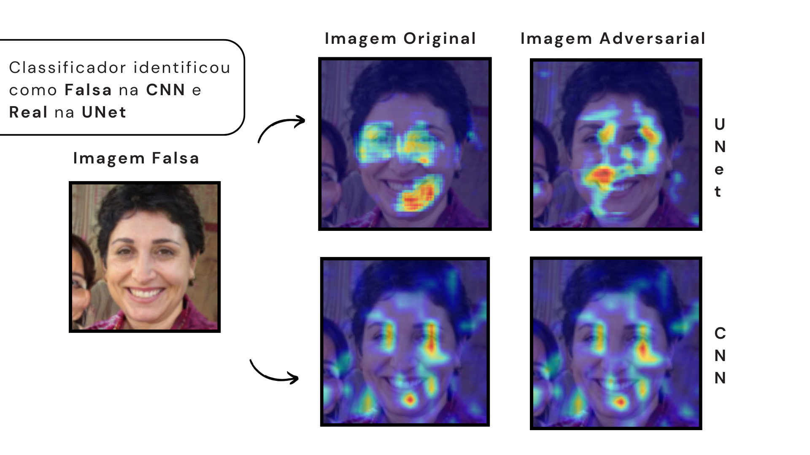
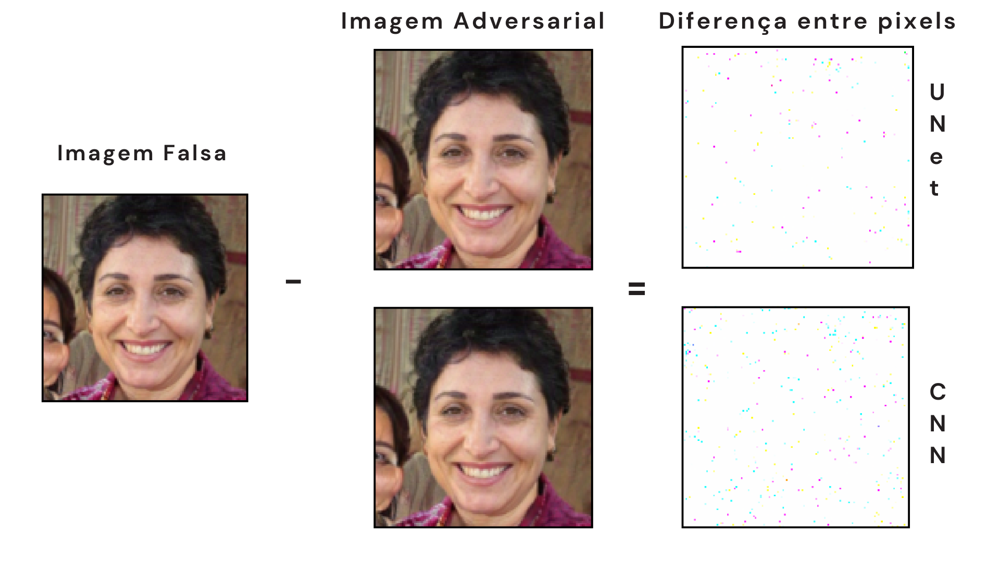

# Fool-the-Model


This repository contains the final project for Information Security course at the University of Campinas (UNICAMP). The project aims to develop adversarial perturbations against DeepFake classifiers. The project is divided into two main parts: the development of DeepFake classifiers and the generation of adversarial examples to fool these classifiers. 

Read more in the project report ["Fool the Model: Developing Adversarial Perturbations Against DeepFake Classifiers"](./docs/main.pdf).

<p align="center">
  
</p>

<p align="center">
  
</p>


## Contents

- [Fool-the-Model](#fool-the-model)
  - [Contents](#contents)
  - [Requirements](#requirements)
    - [Install Dependencies](#install-dependencies)
  - [Download Dataset](#download-dataset)
    - [(Linux only) Alternative Dataset Download](#linux-only-alternative-dataset-download)
  - [Training and Evaluation](#training-and-evaluation)
    - [Train the CNN or UNET classifier](#train-the-cnn-or-unet-classifier)
    - [Train the XGBoost classifier](#train-the-xgboost-classifier)
    - [Train the adversarial generator](#train-the-adversarial-generator)
  - [Visual Results](#visual-results)

## Requirements

We recommend using an environment manager to create an isolated environment for this project.

> [!TIP]
> We recommend using [Micromamba](https://mamba.readthedocs.io/en/latest/installation/micromamba-installation.html) for faster environment management.

> [!IMPORTANT]
> Ensure you have Python >= 3.12 installed. You can use system Python or your environment manager to install Python.

### Install Dependencies
Run the following command to install the required dependencies:

```bash
pip install -r requirements.txt
```

> [!NOTE]
> It's recommended to execute the scripts on a computer with a GPU to speed up the training process and with enough memory to handle the dataset.

## Download Dataset

1. Download the **DeepFake Detection Challenge dataset** from Kaggle. [Click Here](https://www.kaggle.com/datasets/xhlulu/140k-real-and-fake-faces) to access the dataset.
2. Unzip the dataset and place it in the `data` directory. The expected directory structure should be as follows:

```
data
├── train
├── valid
├── test
├── train.csv
├── valid.csv
└── test.csv
```

- The `train.csv`, `valid.csv`, and `test.csv` files contain the paths to the images and their corresponding labels.
- The `train`, `valid`, and `test` directories contain the images.

> [!WARNING]
> Ensure that the dataset structure matches the expected format. Incorrect formatting may cause errors during training.

### (Linux only) Alternative Dataset Download
You can also use the `download_dataset.sh` script to download and extract the dataset:

```bash
./download_dataset.sh
```

## Training and Evaluation

> [!NOTE]
> Every script have a help option that you can use to see the available arguments. For example, `python deepfakes_train.py --help`.

### Train the CNN or UNET classifier

```bash
python deepfakes_train.py --model <model-name> -s <model-output-path> --train
```

This script trains a classifier to detect DeepFakes. You can choose between a CNN or UNET model.

### Train the XGBoost classifier

```bash
python classical_deepfakes_train.py
```

This script trains an XGBoost classifier to detect DeepFakes.

### Train the adversarial generator

For training the adversarial generator using the CNN or UNET as a victim model, use the following command:

```bash
python adversary_train.py --train -e <experiment-name>
```

This script generates perturbations that attempt to fool the classifier. It uses a configuration file located at `configs/adv_config.yaml`.

For `XGBoost`, use the following command:

```bash
python classical_adversary_train.py --train -e <experiment-name>
```

## Visual Results

Some scripts will automatically display visual results after training. We also provide a script to visualize the heatmap of the neural network's activations using the **GradCAM** technique:

```bash
python gradcam.py
```

> [!NOTE]
> You can choose between the CNN and UNET models. **XGBoost does not have heatmap visualization.**

